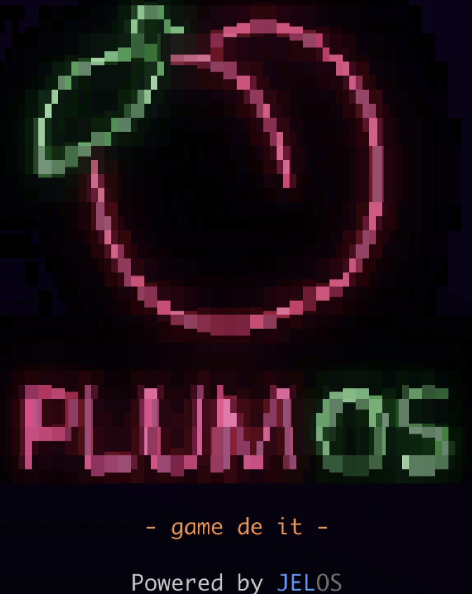
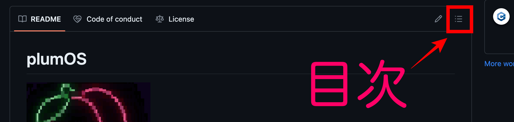
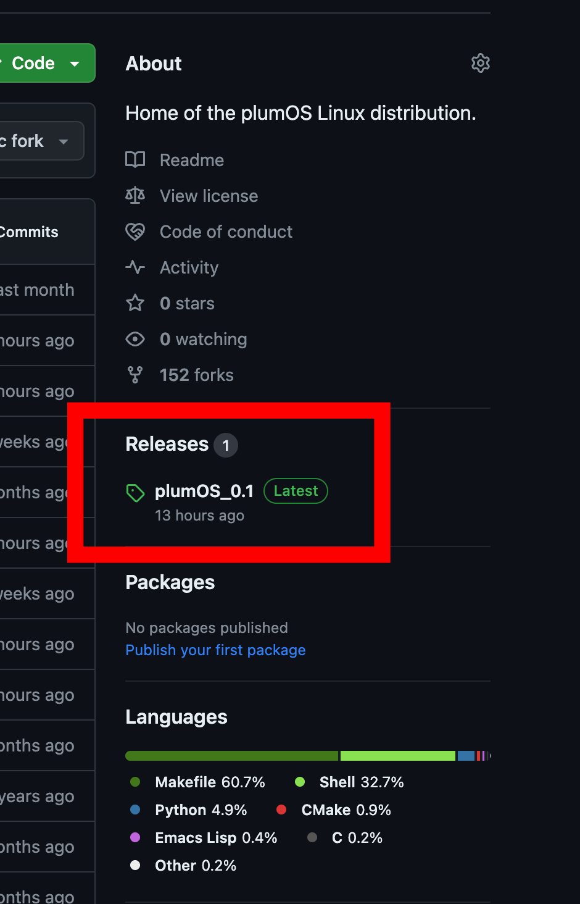
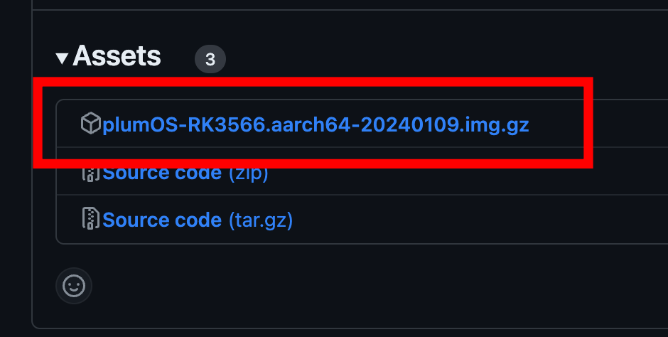
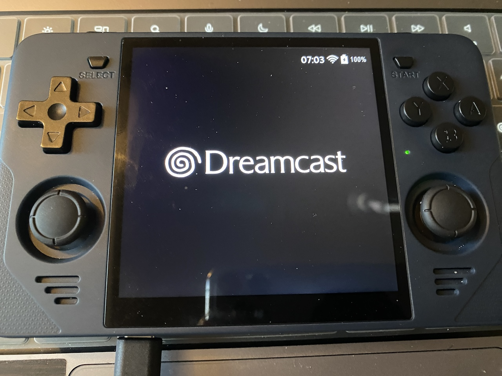
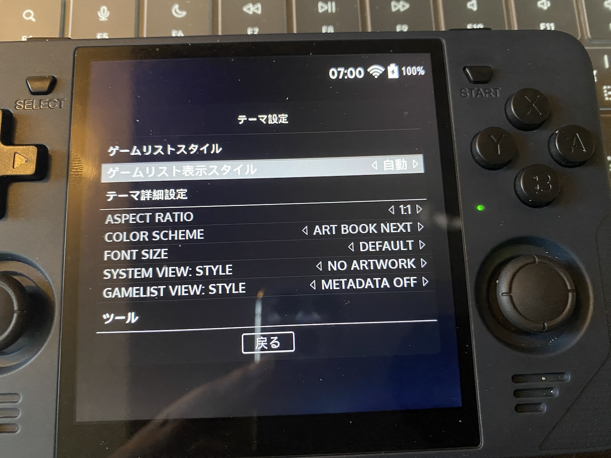

# plumOS

    

## 目次
右上にある「三」アイコンをクリックすると目次が表示されます。  

  

## 特徴
JELOSをベースとした実験的なディストリビューションです。  

## ダウンロード
画面右側のメニューの「Releases」から.img.gzファイルをダウンロードできます。  
 　  

## 既知の問題
- picoarchの問題
  - 早送りができるコア・できないコアがある
  - メニュー画面のキー操作が早い(キーリピートの問題？)
  - 画面の色が変なコアがある
  - アスペクト比がおかしい
- Retroarchの録画機能の問題
  - 録画機能にバグがあり一般的な手順では正常に録画できない
## 謝辞
- オリジナルのJELOS開発チームに感謝と敬意を表します。
- plumOSロゴ＆スプラッシュ画像の提供者 [ Xアカウント : JLさん @JL_0w0] ありがとうございます！
- Emulationstationの日本語化　提供者 [ Xアカウント : unknown優さん @46_un_known] ありがとうございます！
  - ブログURL [https://ameblo.jp/unknown-gra/](https://ameblo.jp/unknown-gra/)

## 更新情報
- [NEW] β版 Ver 0.3をリリース！  
 
## 特徴
### ●基本情報
- デフォルトでEmulationstation、Retroarch、ppsspp-sa(スタンドアローン版)が日本語に設定されています
- Retroarchの設定およびHotkeyを自由に変更可能です
- SDカード内の「/storage/roms/scripts」フォルダに置かれたシェルスクリプトを実行可能です
  - kuran_kuranさん [ Xアカウント : @kuran_kuran ] の「けものローグ」をプレイできます  
[https://github.com/kuran-kuran/KemonoRogue](https://github.com/kuran-kuran/KemonoRogue)
- イコライザーによってスピーカーから出る音の音質を向上させています
- オフラインアップデートに対応(Ver0.2から対応)
  - /storage/.updateにVer0.3以降のアプデファイルを置いて、本体再起動することでアップデートが可能です

### ●対応エミュレータ
JELOSのwikiから左側メニューの「System」セクションから、各エミュレータの情報(対応拡張子など)を確認できます。  
- JELOS wiki [https://jelos.org/](https://jelos.org/)

### picoarchの仕様
- セレクトボタンでメニューが開きます(ゲームプレイに支障が出るため将来このボタンを変更予定)
- picoarchに関連するファイルは「/storage/.config/.picoarch/」に保存されます

### ●Retroarch仕様
- セーブファイルはromファイルと同じフォルダに作成されます(変更可能)
- ステートセーブファイルはromファイルと同じフォルダに作成されます(変更可能)
- いくつかのメニューが隠されているので「設定→ユーザーインターフェイス」から表示させることができます

### ●romsフォルダーの自動作成
ESの画面からSTARTボタンを押してメニューを出して「システム設定」→「ゲームディレクトリの作成」を実行すると、nesやsnesなどのフォルダがromsフォルダ内に生成されます。  

### ●RetroArchのホットキー
- ※Hotkeyの設定は自由に変更可能です  

| Button Combo | Action | 
|:-----------|------------:|
| L3+R3       |        Retroarchメニュー表示 |
| SELECT+R       |        ステートセーブ |
| SELECT+L     |      ステートロード |
| SELECT+R2     |      ファストフォワード(早送りx2倍) |
| SELECT+L2     |      スローモーション(x1.5倍) |
| SELECT+X     |      スナップショット(roms/screenshots) |
| SELECT+Y     |      FPS表示 |
| SELECT+B     |      Retroarchメニュー表示 |
| SELECT+十字キー↑     |      音量アップ |
| SELECT+十字キー↓     |      音量ダウン |

### ●OSのホットキー
| Button Combo | Action | 
|:-----------|------------:|
| SELECT+Vol+       |        画面輝度を上げる |
| SELECT+Vol-       |        画面輝度を下げる |
| SELECT+十字キーの←       |        EQのON/OFF |

### ●Retroarchからシェルスクリプトを実行する手順
- SDカード内の[roms/scripts/]フォルダにシェルスクリプトを置きます
(ファイルの拡張子は .sh にして実行権限を与えてください)

- 下記の手順でもシェルスクリプトを実行可能です
1. 「TOOLS」→「Start Retroarh (64-bit)」を実行します
2. 「コンテンツをロード」→「お気に入り」→「scripts」の順に進み、シェルスクリプトを選択してください

### ●イコライザーについて
「SELECT+十字キーの←」でEQのON/OFFができます。  
イコライザーの音質をチューニングする場合はSDカード内の「.config/pipewire/pipewire.conf.d/sink-eq6.conf」ファイルを編集してOS再起動をしてください。
```
〜　イコライザーのチューニング指南書　〜
基本的にいじる箇所はcontrol = { "Freq" = 100.0 "Q" = 1.0 "Gain" = 0.0 }のような箇所になります。
パラメータの変更後はOSを再起動します

● Freq
変化させる周波数(Hz)です。
(Freqを0にしてGainを上げるとプリアンプのような働きになります。)

● Q
Freqで設定した周波数を中心に前後どれくらいの周波数を巻き込んで変化させるかの値です。
Q値が高いほど影響を受ける帯域幅は狭くなります。
例えばQ値を4.3などにすると帯域幅は非常に狭くなるため、不自然に聞こえる可能性があります。
(Q値を高くしてGainを下げることで特定の周波数をピンポイントで減らし、ノイズフィルターのような感じにも使えます)
0.6から1.0の間のかなり穏やかな値で設定すると良い感じになります。

● Gain
増幅値で-10〜20までの間で設定します。
```

コマンドラインからイコライザーをON/OFFしたい場合は「[イコライザーのリアルタイムON/OFFしたい場合の手順](https://github.com/game-de-it/plumOS/blob/main/documentation/EQ.md)」を参考にしてください


### ●plumOS 超省電力設定
FCやGBなど負荷が少ないゲームを遊ぶ際に、CPUクロックを400MHzまで落として省電力化する手順を記します。  
※ゲームによっては不安定になる可能性があるのでご注意を  


ESの画面からSTARTボタンを押してメニューを出して「システム設定」を開いて下記設定をします。  

- 「スケーリングガバナ選択」を「POEWER SAVE」を選択します　　
- 「GPUパフォーマンスプロファイル」を「BATTERY FOCUS」を選択します
- 「WIFI 省電力を有効」をONにする

# Tips
### ●Emulationstationのデフォルトthemeに時計を表示させる方法
1. 下記URLからzipファイルをダウンロードして解凍します
2. 解凍したフォルダをSDカード内の「themes」フォルダにコピーします  
  (/storage/.emulationstation/themes)  
3. emulationstationの「UI設定→テーマ」の順に進み「es-theme-art-book-next-plumOS」を選択してください


[https://github.com/game-de-it/plumOS/blob/main/packages/themes/es-theme-art-book-next/sources/es-theme-art-book-next-plumOS.zip](https://github.com/game-de-it/plumOS/blob/main/packages/themes/es-theme-art-book-next/sources/es-theme-art-book-next-plumOS.zip)  

### ●デフォルトthemeをシンプルに表示させる方法
emulationstationの「UI設定→テーマ設定」の順に進み、下記の画像のように設定してください。  



---
以上
