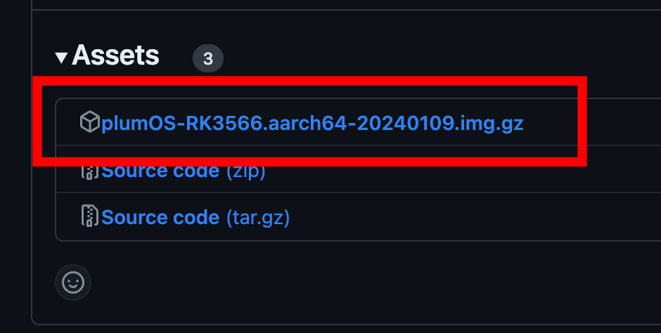

# plumOS
[Click here for the English version of the explanation page](./README_EN.md)

   

## table of contents
Click the "three" icon at the top right to display the table of contents.


## Features
This is an experimental distribution based on JELOS.

## Download
You can download the .img.gz file from "Releases" in the menu on the right side of the screen.
  　

## Known issues
- picoarch issue
   - Some cores can and cannot perform fastforward.
- Problem with Retroarch recording function
   - There is a bug in the recording function and it cannot be recorded normally using standard procedures.

## Acknowledgments
- We would like to express our gratitude and respect to the original JELOS development team.
- plumOS logo & splash image provider [X account: JL @JL_0w0] Thank you!
- Emulationstation Japanese translation provided by [X account: Yu unknown @46_un_known] Thank you!
   - Blog URL [https://ameblo.jp/unknown-gra/](https://ameblo.jp/unknown-gra/)

## update information
- [NEW] Beta version Ver 0.5 released!
- [Compatible with retro game engine "Pyxel"](https://github.com/kitao/pyxel)
   - File expansion supports .py .pyxapp .edit
   - To start the editor, place an empty file called "<any file name>.edit (e.g. hogehoge.edit)" in the "/storage/roms/pyxel" folder and then run it.
     - Editor save files are located under the "/storage/.config/.pyxel/save" folder
   - Known issues
     - There are games and applications that cannot be closed using the ESC key (SELECT button).
       - Please press the reset button or connect via SSH and run "killall -9 pyxel"
     - Depending on the game, it may not be possible to operate with the default keymap
       - See "Steps to change pyxel keymap settings"

## Features
### ●Basic information
- Emulationstation, Retroarch, ppsspp-sa (standalone version) are set to Japanese by default
- Retroarch settings and Hotkeys can be changed freely
- Shell scripts placed in the "/storage/roms/scripts" folder in the SD card can be executed
   - You can play "Kemono Rogue" by kuran_kuran [X account: @kuran_kuran]
[https://github.com/kuran-kuran/KemonoRogue](https://github.com/kuran-kuran/KemonoRogue)
- Equalizer improves the sound quality of the sound coming from the speakers
- Supports offline update (supported from Ver0.2)
   - You can update by placing the update file for version 0.3 or later in /storage/.update and restarting the device.

### ●Automatic creation of roms folder
If you press the START button from the ES screen to bring up the menu and select "System Settings" → "Create Game Directory", folders such as NES and snes will be created in the roms folder.

### ●plumOS compatible emulator
Since plumOS is based on JELOS, you can check information for each emulator (compatible extensions, etc.) from the "System" section on the left menu on the JELOS wiki.
- JELOS wiki [https://jelos.org/](https://jelos.org/)

### ●picoarch specifications
- Open the menu by pressing the select button + start button
   - Be sure to "save config" after changing settings in the option menu
   - Depending on the settings, you may need to rerun picoarch, so don't forget to save your settings.
- Files and save data related to picoarch are saved in "/storage/.config/.picoarch/"
   - For samba connection, there is ".picoarch" in the "config" folder
- How to use picoarch HD and LD
   - For settings of the entire emulator section
On the ROM selection screen, go to "Select key → System details → Emulator" and select "picoarch_HD" and "picoarch_LD".
   - Settings for each ROM
Select the appropriate ROM file, go to "X button → Advanced settings for this game → Emulator", and select "picoarch_HD" and "picoarch_LD". This setting takes precedence over the settings for the entire emulator section.
- Picoarch compatible core list

| cores name | type |
|:------------|------------:|
| beetle_ngp_libretro.so | neogeo pocket(color) |
| fake-08_libretro.so | pico-8 |
| gearsystem_libretro.so | gamegear,sms |
| smsplus-gx_libretro.so| gamegear,sms |
| picodrive_libretro.so | megadrive,gamegear,sms |
| quicknes_libretro.so | nes,fds |
| fceumm_libretro.so | nes,fds |
| nestopia_libretro.so | nes,fds |
| beetle-pce-fast_libretro.so | pcengine(CD) |
| gambatte_libretro.so | gb(color) |
| gpsp_libretro.so | gba |
| mgba_libretro.so | gba |
| pcsx_rearmed_libretro.so | psx |
| beetle_wswan_libretro.so | wonderswan(color) |
| fmsx_libretro.so | msx,msx2 |
| snes9x_libretro.so | snes |
| snes9x2010_libretro.so | snes |
| dosbox-pure_libretro.so | pc |
| pokemini_libretro.so | pokemini |

- Default hotkey list
   - *Hotkey settings can only be changed for the keys displayed in Button Combo.

| Button Combo | Action |
|:------------|------------:|
| SELECT+START | picoarch menu display |
| SELECT+R | Save state |
| SELECT+L | State load |
| SELECT+R2 | fastforward (fast forward x 3x speed) |
| SELECT+L2 | FPS display/hide |


### ●Retroarch specifications
- The save file will be created in the same folder as the rom file (can be changed)
- The state save file is created in the same folder as the rom file (can be changed)
- Some menus are hidden, so you can display them from "Settings → User Interface"
- Steps to run a shell script from Retroarch
   - Place the shell script in the [roms/scripts/] folder in the SD card
(Please change the file extension to .sh and give execution permission)
- You can also execute the shell script by following the steps below.
   1. Run “TOOLS” → “Start Retroarh (64-bit)”
   2. Go to "Load Content" → "Favorites" → "scripts" and select the shell script
- RetroArch hotkeys
   - *Hotkey settings can be changed freely

| Button Combo | Action |
|:------------|------------:|
| L3+R3 | Retroarch menu display |
| SELECT+R | Save state |
| SELECT+L | State load |
| SELECT+R2 | Fast forward (fast forward x2) |
| SELECT+L2 | Slow motion (x1.5) |
| SELECT+X | Snapshots (roms/screenshots) |
| SELECT+Y | FPS display |
| SELECT+B | Retroarch menu display |
| SELECT + cross key ↑ | Volume up |
| SELECT + cross key ↓ | Volume down |

### ●OS hotkeys
| Button Combo | Action |
|:------------|------------:|
| SELECT+Vol+ | Increase screen brightness |
| SELECT+Vol- | Decrease screen brightness |
| SELECT + cross key ← | EQ ON/OFF |

### Steps to change pyxel keymap settings
Edit the file that defines the keymap located at the path below
- "/storage/.config/.pyxel/default.gptk"

The contents of "default.gptk" are as shown below, and the format is "controller side = keyboard (mouse) side".

For example, if you want to assign z on the keyboard to the A button on the controller, define "a = z".
On the controller side, "back" is the "SELECT button", "start" is the "START button"” means.

If you set the keyboard side to "none", the controller signal defined by the OS will be output.
If the game is mainly operated by a controller, set it to "none", and if the game is mainly operated by a keyboard, set the keyboard keys.

By default, the right stick is used for mouse operation, but it is also possible to change the left stick to mouse operation.
If you want to change the sensitivity of the mouse, please adjust the value of "mouse_delay".
````
back = esc
start = enter
a = none
b = none
x = none
y = none
up = none
down = none
left = none
right = none

left_analog_as_mouse = false
right_analog_as_mouse = false

left_analog_up = up
left_analog_down = down
left_analog_left = left
left_analog_right = right

right_analog_up = mouse_movement_up
right_analog_down = mouse_movement_down
right_analog_left = mouse_movement_left
right_analog_right = mouse_movement_right
l1 = mouse_right
r1 = mouse_left

deadzone_y = 2000
deadzone_x = 2000
deadzone_triggers = 10
mouse_scale = 1024
mouse_delay = 64
````
### ●About the equalizer
You can turn EQ ON/OFF with "SELECT + ← on the cross key".
If you want to tune the sound quality of the equalizer, please edit the ".config/pipewire/pipewire.conf.d/sink-eq6.conf" file in the SD card and restart the OS.
````
~ Equalizer tuning guide ~
Basically, the places to modify are places like control = { "Freq" = 100.0 "Q" = 1.0 "Gain" = 0.0 }.
Restart the OS after changing parameters

● Freq.
This is the frequency (Hz) to change.
(If you set Freq to 0 and increase Gain, it will work like a preamplifier.)

●Q
This is the value that determines how many frequencies around the frequency set in Freq are involved and varied.
The higher the Q value, the narrower the bandwidth affected.
For example, if you set the Q value to 4.3, the bandwidth will be very narrow and it may sound unnatural.
(By increasing the Q value and lowering the Gain, you can pinpoint a specific frequency and use it as a noise filter.)
Setting it to a fairly moderate value between 0.6 and 1.0 will give you a good feel.

● Gain
Set the amplification value between -10 and 20.
````

If you want to turn the equalizer ON/OFF from the command line, see "[Steps to turn the equalizer on/off in real time]" (https://github.com/game-de-it/plumOS/blob/main/documentation/EQ.md)" Please refer to


### ●plumOS ultra power saving settings
This article describes the steps to reduce the CPU clock to 400MHz to save power when playing games with low load such as FC and GB.
*Please note that some games may become unstable.


From the ES screen, press the START button to bring up the menu, open "System Settings" and make the following settings.

- Select "POEWER SAVE" for "Scaling governor selection"
- Select "BATTERY FOCUS" for "GPU Performance Profile"
- Turn on "enable WIFI power saving"

#Tips
### ●How to display a clock in the default theme of Emulationstation
1. Download the zip file from the URL below and unzip it.
2. Copy the unzipped folder to the “themes” folder on the SD card
   (/storage/.emulationstation/themes)
3. Go to "UI Settings → Theme" on emulationstation and select "es-theme-art-book-next-plumOS"


[https://github.com/game-de-it/plumOS/blob/main/packages/themes/es-theme-art-book-next/sources/es-theme-art-book-next-plumOS.zip ]  


### ●How to simply display the default theme
Go to "UI Settings → Theme Settings" of emulationstation and configure the settings as shown in the image below.
   - With this setting, thumbnail images will not be displayed


---
that's all