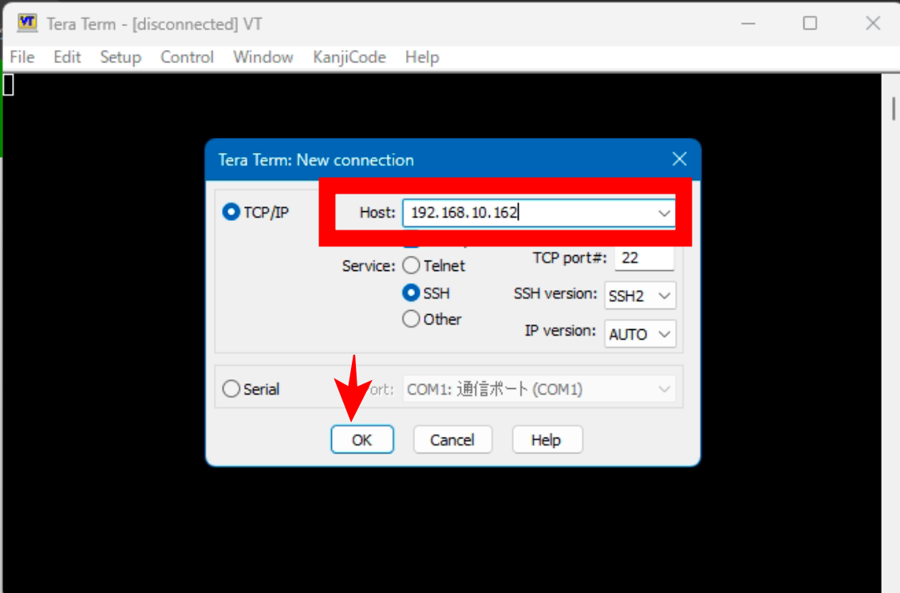
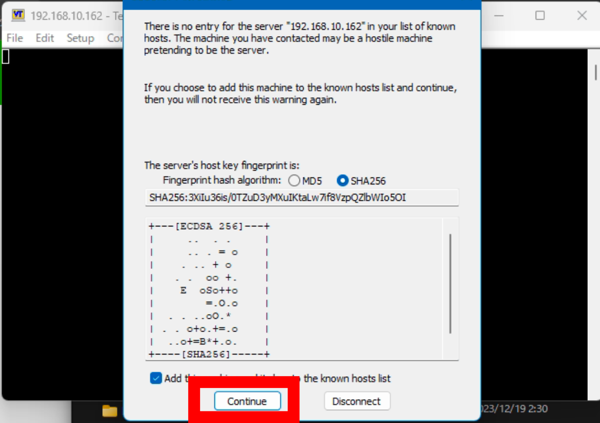
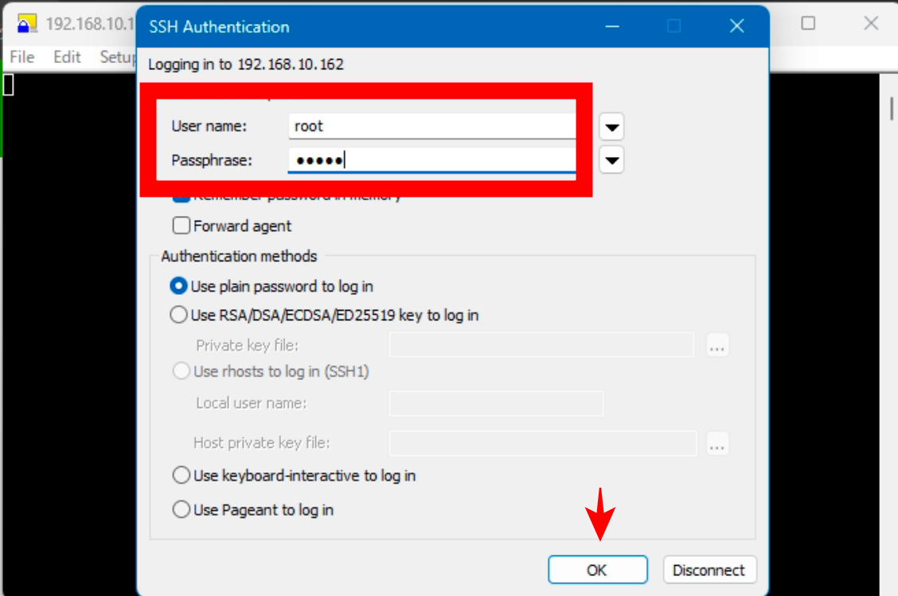
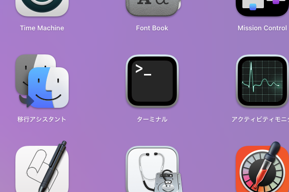

# イコライザーのリアルタイムON/OFF

コマンドラインからイコライザーをON/OFFすることができます。  
ゲームプレイ中でもリアルタイムでイコライザーのON/OFFが切り替わるため、音の違いを実感していただくことができます。

# windowsの手順
Tera TermはplumOSにネットワークから接続するためのアプリです。  
前提として、plumOSをWifiネットワークに接続しておき、システム設定から「ルートパスワード」の設定を完了させて、ネットワーク設定から「SSH有効」をしてください。  


1. 下記のリンクからDLして解凍します。
[https://forest.watch.impress.co.jp/library/software/utf8teraterm/download_10869.html](https://forest.watch.impress.co.jp/library/software/utf8teraterm/download_10869.html)  

2. 解凍したフォルダ内の「ttermpro.exe」を実行します。  
下記の画面が表示されたら「Host」にplumOSのIPアドレスを入力してOKボタンを押します。  
  

3. 下記の画面が表示されたらOKボタンを押します。  
  

4. 下記の画面が表示されたら  
- 「User name:」に「root」を入力  
- 「Passphrease:」にplumOSの「ルートユーザーパスワード」を入力  
OKボタンを押してplumOSのロゴ画像が表示されたら接続が完了です。  
  

5. 下記のコマンドをコピーして黒い画面で右クリックして貼り付けてエンターキーを押します。
```
イコライザーをOFF(大音量が流れますので注意してください)

pactl set-default-sink alsa_output._sys_devices_platform_rk817-sound_sound_card0.stereo-fallback
```
  
```
イコライザーをON

pactl set-default-sink effect_input.eq6
```
- ※注意  
イコライザーの音量はOFFの時の音量がベースとなります。  
例えばイコライザーOFF＝音量50％の状態でイコライザーONにすると、最大音量が50％に制限されます。  
よってONの時に正しい音量を得るためには、イコライザーOFF＝100％音量にしておく必要があります。  

windowsでの手順は以上です。
---

# MacOSの手順
1. ターミナルを開きます
  

2. 下記コマンドを入力してエンターを押します
```
下記IPアドレスはplumOSのIPアドレスに置き換えてください。

ssh root@192.168.10.162

※もしYes/Noの選択肢が表示された場合は yes　と入力してエンターを押してください。
```

3. パスワードを入力する画面が表示されたら、plumOSの「ルートユーザーのパスワード」を入力してエンターを押します。  
※セキュリティ上、画面には入力中のパスワードは表示されませんので、正確に入力してエンターキーを押します。    

plumOSのロゴ画像が表示されたら接続が完了です。  

4. 下記のコマンドをコピーして黒い画面で右クリックして貼り付けてエンターキーを押します。
```
イコライザーをOFF(大音量が流れますので注意してください)

pactl set-default-sink alsa_output._sys_devices_platform_rk817-sound_sound_card0.stereo-fallback
```
  
```
イコライザーをON

pactl set-default-sink effect_input.eq6
```
- ※注意  
イコライザーの音量はOFFの時の音量がベースとなります。  
例えばイコライザーOFF＝音量50％の状態でイコライザーONにすると、最大音量が50％に制限されます。  
よってONの時に正しい音量を得るためには、イコライザーOFF＝100％音量にしておく必要があります。  

MacOSでの手順は以上です。
