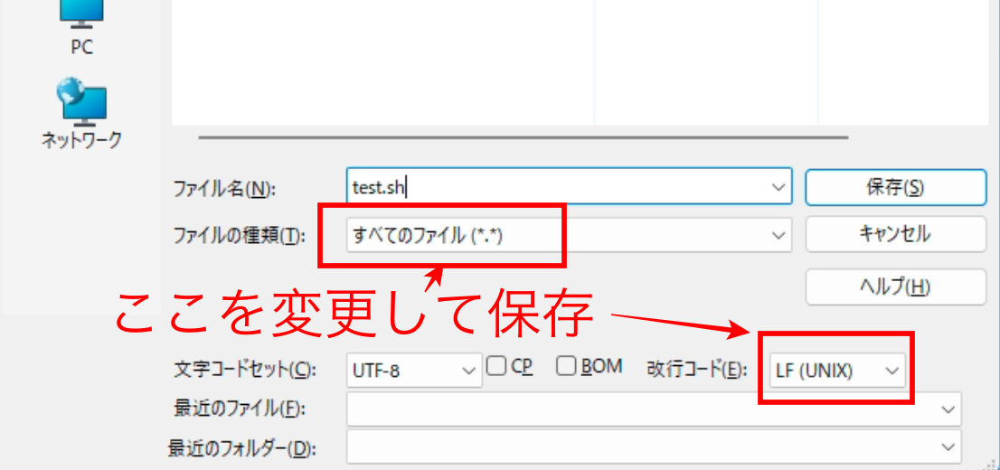
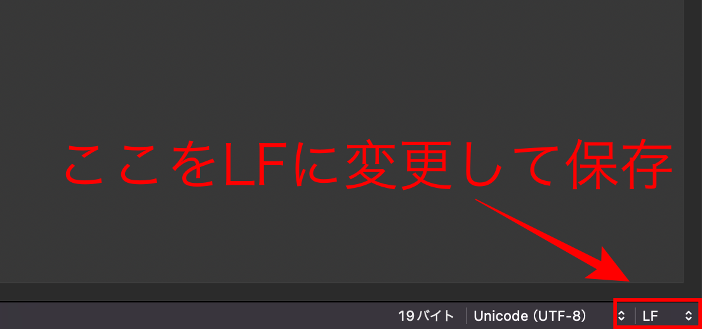

# シェルスクリプトの基礎
## はじめに
シェルスクリプトとはLinuxコマンドを実行する「シェル」とコマンドの一連の流れを記述した「スクリプト」を意味した言葉です。  

Linuxコマンドの一例としては  
- ファイル一覧を表示する「ls」
- ファイルをコピーする「cp」
- ファイルを移動する「mv」
- ディスク容量を表示する「df」  
などなど  

それらのコマンドを実行するために必要なプログラムのことを「シェル」と言います。  
シェルも種類がたくさんあり  
- bash
- sh
- ksh
- zsh  
などなど  

linuxのコマンドはこれらシェルを介して実行されます。  
シェルによっては配列の取り扱いや環境変数の違いなど様々な違いがあります。  

このページでは様々なシェルと互換性が高い「sh」を基準に話を進めます。  
なお今日のシステムではshを利用した場合に、より多機能なbashが代わりとして利用されることも多くあります。  

難しい話は置いておいて、まずはシェルスクリプトを「書いて」→「実行する」を実践して行きましょ。  
## sayコマンドについて


plumOSには「say」というコマンドが存在し、与えられた文字列を英語の発音で喋ってくれます。  

sayコマンドの使い方  
```
say <しゃべらせたい文字列>
```
このように　say の後にスペースを開けてから、しゃべらせたい文字列を入力するだけです。
例えば
```
say kyouha tenkiga yoidesune
```
このような感じに記述します。  

## シェルスクリプトを書くための準備
シェルスクリプトは一般的なメモ帳のようなアプリで作成することができます。  
ただし、改行コードが「CRLF」の場合、linuxではテキストの内容を正しく読み込めません。  
外部エディタを利用することで改行コードを「LF」にすることができます。  

Windowsの方は「Sakuraエディタ」をダウンロードしてください。  
[https://github.com/sakura-editor/sakura/releases](https://github.com/sakura-editor/sakura/releases)    

  
MacOSを利用の方は「CotEditor」をダウンロードしてください  
[https://coteditor.com/](https://coteditor.com/)


## シェルスクリプト実践
それでは早速sayコマンドで喋らせるシャルスクリプトを書いてみましょう。  
エディタを開いたら新規テキストに以下のように記述してください。  
```
#!/bin/sh
say kyouha tenkiga yoidesune
```
これで完了です。  
ちなみに1行目の「#!/bin/sh」はシェルの「sh」を利用するという宣言になります。  

続いてこのテキストを「test.sh」という名前で保存します。  
次のように設定して保存してください。  

- sakuraエディタの場合
  

- CotEditorの場合
  

ファイルが保存できたら「test.sh」ファイルをSDカードの「roms/scripts」フォルダにコピーして、EmulationstationからROMリストの更新をしてください。  

Emulationstationの「SHELL SCRIPTS」から「test」を実行すると音声が流れると思います。

以上